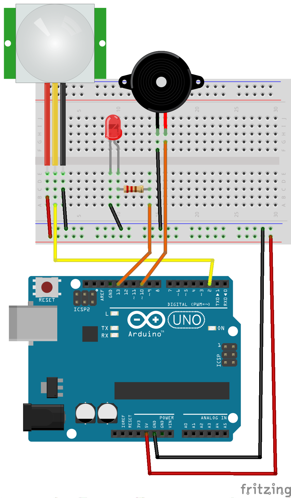
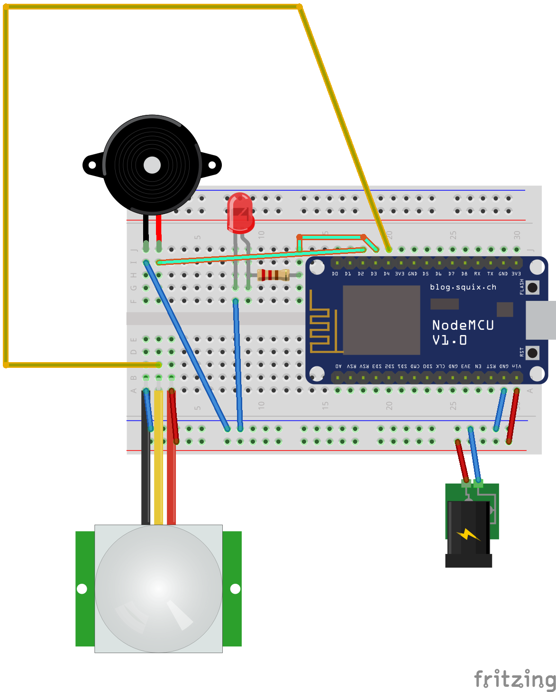
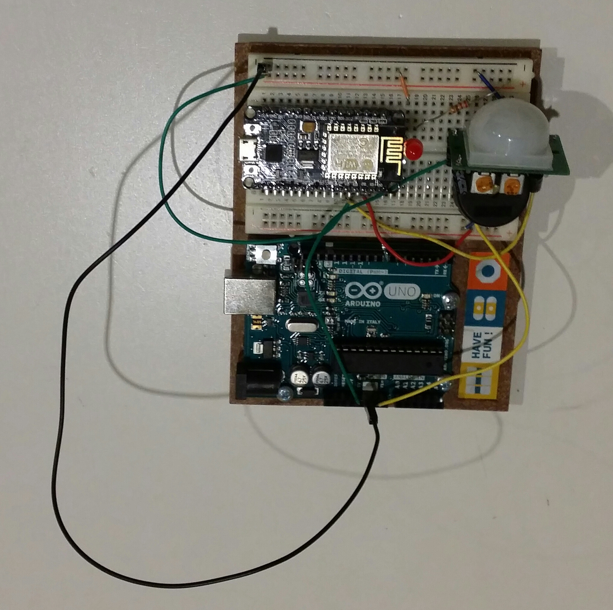
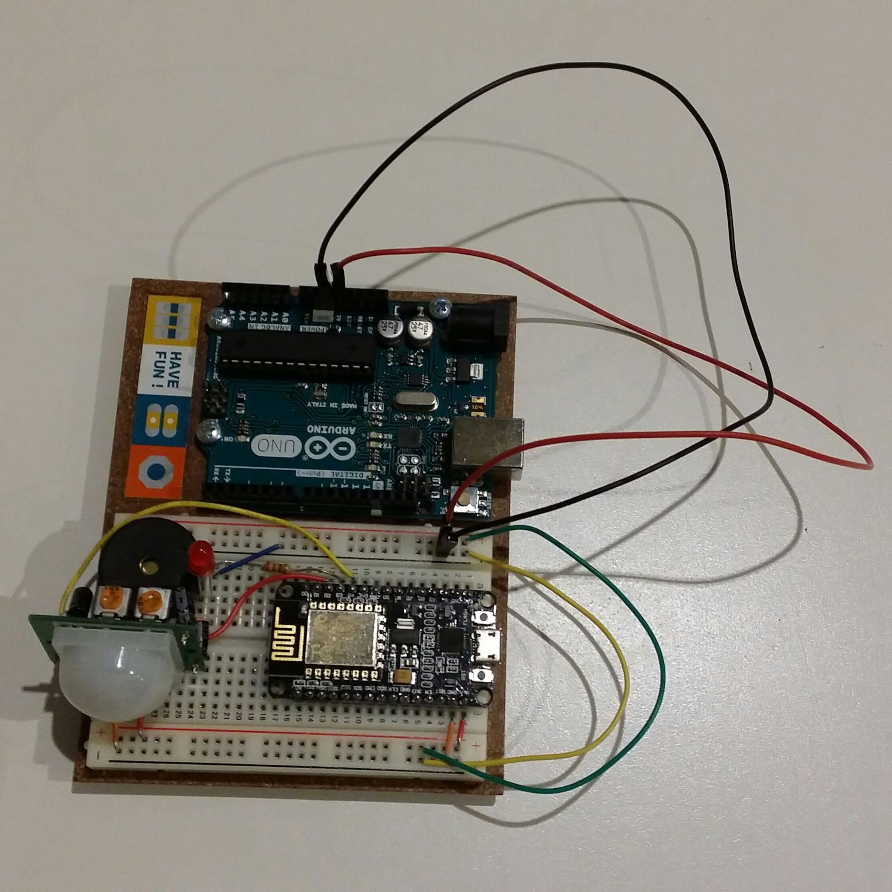

# detecteur_mouvement
Detecteur de mouvement connecté.

## But du projet

Faire un detecteur de mouvement connecté à l'aide d'un nodemcu et d'un capteur de mouvement HC-SR501.
Pour commencer je pars d'un arduino UNO avec un programme dans le langage d'origine(C/C++) ensuite je vais migrer vers le nodeMCU et redevelopper cet enorme programme :p en lua.

## Etapes du projet

1. Tester le materiel
  1. NodeMCU
  1. PIR
1. Faire un detecteur de presence avec l'Arduino
1. Faire un detecteur de presence avec le NodeMCU
1. Etudier les posibilités de transfert de message
    * Protocoles
      * udp
      * mqtt
    * Framework
      * Flink / Kafka / Aucun?
1. Etudier l'infra
    * Materiel
      * batteries
      * Serveurs
      * Routeur
      * Switch
      * ???
    * Gestion
      * maison/ cloud / mixte?
      * baremetal / docker / kubernetes / rancher
1. Etudier les méthodes d'accès et de maintenance
    * Test de vie
    * Mises à jours
    * Charge/echange batteries
    * Api
1. Et surement des choses que j'ai oublié

## Où en est le projet

- [x] Test materiel
- [x] detecteur de presence Arduino
- [x] detecteur de presence NodeMCU
- [ ] transfert de messages(En cours voir sous module data_streaming)
- [ ] Infra(En cours)
- [ ] Accès et maintenance

## Prérequis pour la version Arduino UNO 

* PIR

* Arduino UNO

* Arduino Studio 

* led

* buzzer

* resistance 220ohm

## Prérequis NodeMCU

* PIR

* NodeMCU  

* un editeur de texte pour NodeMCU

* Un firmware a jour en 1.5 stable

* esptool

* nodejs

* nodemcu-tool

## Schema de montage Arduino

## Schema de montage NodeMCU

## Source montage Arduino

### Montage que j'ai utilisé

http://makezine.com/projects/pir-sensor-arduino-alarm/

C'est super sympa il y a une led et un buzzer mais je n'aime pas son site car il est trop chargé. J'ai forké son projet et l'ai ajouté en submodule de ce projet. Je ne pense pas avoir à le modifier mais c'est juste pour que l'on n'oublie pas l'auteur original merci John Edgar Park.

#### code source

git@github.com:apprensemble/Make_PIR_Sensor.git

### Montage sympa mais que je n'ai pas testé

https://learn.adafruit.com/pir-passive-infrared-proximity-motion-sensor/using-a-pir

## Source montage NodeMCU

Je me suis appuyé sur le montage Arduino et l'API officiel NodeMCU qui se trouve dans les ressources en bas.
C'était amusant :)

### Photos de la V2 et la V3

Pour la petite histoire la V1 est une version sans speaker, je pensais ne pas avoir assez de place sur le breadboard. La V2 est une version avec speaker et la V3 est une version ou j'ai optimisé le placement des composants.

## Ressources liés aux composants

### PIR

https://learn.adafruit.com/pir-passive-infrared-proximity-motion-sensor/overview

### NodeMCU

http://nodemcu.com/index_en.html

https://github.com/nodemcu/nodemcu-firmware

https://nodemcu.readthedocs.io/en/master/

https://github.com/nodemcu/nodemcu-devkit-v1.0

### Arduino

https://www.arduino.cc/

### Fritzing

http://fritzing.org/home/

#### Composant PIR pour Fritzing

https://github.com/adafruit/Fritzing-Library/blob/master/parts/PIR%20sensor.fzpz

## Où l'acheter :

http://www.ebay.fr/itm/2x-Pyroelectric-IR-Infrared-PIR-Motion-Sensor-Detector-Module-HC-SR501-Arduino/361399724300?ssPageName=STRK%3AMEBIDX%3AIT&_trksid=p2057872.m2749.l2649

 http://www.ebay.fr/itm/NodeMCU-Lua-WIFI-Internet-Development-Board-Based-on-ESP8266-ESP-12E-CP2102/262491147220?ssPageName=STRK%3AMEBIDX%3AIT&_trksid=p2057872.m2749.l2649
